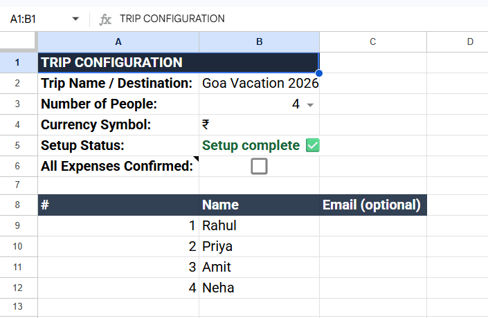

<div align="center">

# ✈️ Dynamic Group Travel Expense Splitter

**A zero-dependency, open-source Splitwise alternative built directly inside Google Sheets.**
Instant per-person split calculations, a live group summary panel, greedy debt minimization, and 1-click personalized PDF email reports.

[](#)
[](#)
[](LICENSE)
[](CONTRIBUTING.md)

<br />

<!-- ================================================================= -->
<!-- SCREENSHOT PLACEHOLDER 1: HERO DEMO GIF -->
<!-- Replace 'assets/hero-demo.gif' with your recorded workflow GIF -->
<!-- ================================================================= -->
<a href="#-quick-start">
  
</a>

<br /><br />

[**🚀 Click Here to Make a Copy in Google Drive**](https://docs.google.com/spreadsheets/d/11dY2B2j1dNIRlWfagUtbX13LRmW894mhnhCGBVsx9oQ/copy)
*(No installation required for non-technical users)*

</div>

---

## 🌟 Why Use This Over Splitwise?

* **100% Free & Self-Hosted:** No subscription limits, item limits, or ads. Your trip data stays inside your Google Drive.
* **Instant Live Calculations:** Per-person split columns compute the moment you type an expense — no confirm step, no waiting, just like a native spreadsheet formula.
* **Live Summary Panel:** A persistent dashboard beside your entries always shows the **Total Spent (Everyone)**, each person's **Spent (Share)** — what they technically consumed even if they paid nothing — and their **Net Balance** (+ collect / − owe).
* **Greedy Settlement Engine:** On confirmation, computes the mathematically optimal minimum number of transactions to clear all group debts.
* **Automated PDF Email Statements:** Generates clean, personalized HTML/PDF expense reports — each person receives only the expenses that involve them — dispatched via Gmail in one click.
* **Dynamic Roster Scaling:** Scale your group seamlessly from 2 to 15 people — the grid, dropdowns, person columns, and summary panel auto-adjust on the fly.
* **Mobile-First Workflow:** Full functionality through checkboxes and automatic triggers; no dependency on desktop-only custom menus.

---

## 📸 Screenshots & Workflow

<table width="100%">
  <tr>
    <td width="50%" align="center">
      <b>1. Trip & Roster Setup</b><br /><br />
      <!-- SCREENSHOT PLACEHOLDER 2: SETUP TAB -->
      
    </td>
    <td width="50%" align="center">
      <b>2. Smart Expense Tracker + Live Summary</b><br /><br />
      <!-- SCREENSHOT PLACEHOLDER 3: EXPENSES TAB -->
      
    </td>
  </tr>
  <tr>
    <td width="50%" align="center">
      <b>3. Simplified Settlements</b><br /><br />
      <!-- SCREENSHOT PLACEHOLDER 4: SETTLEMENT PLAN -->
      
    </td>
    <td width="50%" align="center">
      <b>4. Generated Email PDF Report</b><br /><br />
      <!-- SCREENSHOT PLACEHOLDER 5: PDF EMAIL REPORT -->
      
    </td>
  </tr>
</table>

---

## ⚡ Quick Start

### Option A: 1-Click Google Sheet Template (Easiest)
1. Click the **[Make a Copy Template Link](https://docs.google.com/spreadsheets/d/11dY2B2j1dNIRlWfagUtbX13LRmW894mhnhCGBVsx9oQ/copy)**.
2. Open the newly created spreadsheet in your Google Drive.
3. Open the custom **Expense Splitter** menu at the top and select `1. Initialize / Reset Tracker`.
4. Authorize the Google Apps Script permissions when prompted.

### Option B: Manual Setup via Google Apps Script
1. Create a blank **Google Sheet**.
2. Navigate to **Extensions** → **Apps Script**.
3. Replace all content in `Code.gs` with the code from [`main.gs`](main.gs).
4. Save the project and click **Run** on the `setup` function to authorize scopes (including **Send email as you**, required for PDF reports).
5. Reload your Google Sheet — the custom **Expense Splitter** menu will appear in the top navigation toolbar.

---

## 🧭 The Three Tabs

### 1️⃣ Setup
Configure the trip and the group:

| Cell | Setting | Default |
|------|---------|---------|
| `Setup!B2` | Trip Name / Destination | Goa Vacation 2026 |
| `Setup!B3` | Number of Participants (dropdown 2–15) | 4 |
| `Setup!B4` | Currency Symbol | ₹ |
| `Setup!B5` | Setup Status (auto-validated) | — |
| `Setup!B6` | **All Expenses Confirmed** master checkbox | ☐ FALSE |
| `Setup!A9:C…` | Roster: `#` · `Name` · `Email (optional)` — rows scale with B3 | — |

> Emails are **optional** — only people with an email address receive PDF reports; everyone else is cleanly skipped and logged.

### 2️⃣ Expenses
Enter expenses in columns **A–E**; everything else is computed live:

| Column | Field | Type |
|--------|-------|------|
| A | Date | Date-validated (dd-mmm-yyyy) |
| B | Description | Free text |
| C | Amount | Currency-formatted |
| D | Paid By | Dropdown, auto-filled from roster |
| E | Split Among | `All`, blank, or comma-separated names |
| F+ | *One column per person* | Auto-computed share per row |
| **K–M** | **LIVE SUMMARY panel** | Always-on totals (4-person roster; shifts right for larger groups) |

**LIVE SUMMARY panel** (updates instantly, never hidden):

```
┌────────────────────┬───────────────┬──────────────────────────┐
│ LIVE SUMMARY                                                │
├────────────────────┴───────────────┬──────────────────────────┤
│ Total Spent (Everyone)             │                 ₹10,000  │
├────────────────────┬───────────────┼──────────────────────────┤
│ Person             │ Spent (Share) │ Net (+ collect / − owe)  │
├────────────────────┼───────────────┼──────────────────────────┤
│ Rahul              │      ₹2,500   │                 −₹2,500  │
│ Priya              │      ₹2,500   │                 +₹7,500  │
└────────────────────┴───────────────┴──────────────────────────┘
```

**Duo example:** if only Person 2 pays a ₹1,000 hotel bill split between both, Person 1's row still shows **Spent ₹500** — their technical share of the expense — with a Net of **−₹500** (they owe), while Person 2 shows Spent ₹500, Net **+₹500**.

### 3️⃣ Send Reports
Gated behind the **All Expenses Confirmed** checkbox. On confirmation it runs the greedy settlement engine and shows:

* **Personal Balances Summary** — per-person Total Paid, Total Share, Net Balance, and email delivery status.
* **Simplified Settlement Plan** — the minimum set of "X pays Y ₹amount" transactions that settles the whole group.

---

## ⚙️ How It Works

### Equal & Partial Splits
* **"All" or blank Split Among:** cost splits equally across the whole roster.
* **Comma-separated names** (`Rahul, Neha`): cost splits only within that subgroup.
* **Remainder handling:** fractional paisa left over from division is allocated to the payer so group balances always reconcile to zero.

### Minimum Transaction Engine (Greedy)
Instead of N × (N−1) individual repayments, net debtors and creditors are matched largest-first:

```
[ Debtors (sorted desc) ]  ←———→  [ Creditors (sorted desc) ]
            |                                 |
            +——— settle min(owe, owed) ———→  repeat until zero
```

### Performance Design
* One batched read + two batched writes per edit — no per-cell API calls in the hot path.
* Structural rebuilds (headers, dropdowns, validations) happen **only** on Setup/roster changes, never while typing expenses.
* The Send Reports sheet rebuilds only on confirm toggles and while confirmed.
* UI dialogs degrade gracefully (alert → toast → log), so mobile and trigger contexts never crash.

---

## 🧰 Menu Reference (Desktop)

| Menu Item | Action |
|-----------|--------|
| `1. Initialize / Reset Tracker` | Builds all sheets, dropdowns, and formatting from scratch |
| `2. Recalculate Expenses & Settlements` | Forces a full recalculation |
| `Confirm All Expenses` | Publishes balances + settlement plan (assignable to a drawing button) |
| `Re-open for Editing (Unconfirm)` | Withdraws the report view |
| `3. Send PDF Reports via Email` | Emails personalized PDF statements to roster emails |
| `Test Email Permission` | Sends a test mail to verify the send-mail authorization |
| `Fix Expenses Sheet Formatting` | One-time cleanup of legacy formatting/validation |
| `Diagnose` | Reports the health of every moving part |

> **Mobile users:** menus don't exist in the Sheets app — use the `Setup!B6` checkbox; everything else is automatic.

---

## 📂 Project Architecture

```
dynamic-travel-expense-splitter/
├── main.gs                   # Production-ready Apps Script engine
├── README.md                 # Project documentation
├── LICENSE                   # MIT License
└── assets/                   # Screenshots, diagrams, and hero GIFs
    ├── hero-demo.gif
    ├── setup-tab.png
    ├── expenses-tab.png
    ├── settlements-tab.png
    └── pdf-report.png
```

---

## 🔧 Troubleshooting

| Symptom | Fix |
|---------|-----|
| Emails not sending | Run **Test Email Permission** and approve "Send email as you"; mails are sent from the account running the script |
| Person columns blank | Ensure the row has Amount + Paid By; names in Split Among must match roster spelling |
| Stray checkboxes / colors from an old version | Run **Fix Expenses Sheet Formatting** once (clears all expense rows) |
| Something feels off | Run **Diagnose** and read the reported state |

---

## 🤝 Contributing

Contributions are welcome! Please feel free to open an issue or submit a pull request:

1. Fork the Repository.
2. Create your Feature Branch (`git checkout -b feature/AmazingFeature`).
3. Commit your Changes (`git commit -m 'Add some AmazingFeature'`).
4. Push to the Branch (`git push origin feature/AmazingFeature`).
5. Open a Pull Request.

---

## 📜 License

Distributed under the MIT License. See `LICENSE` for more information.
